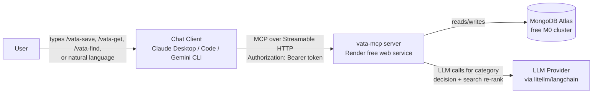
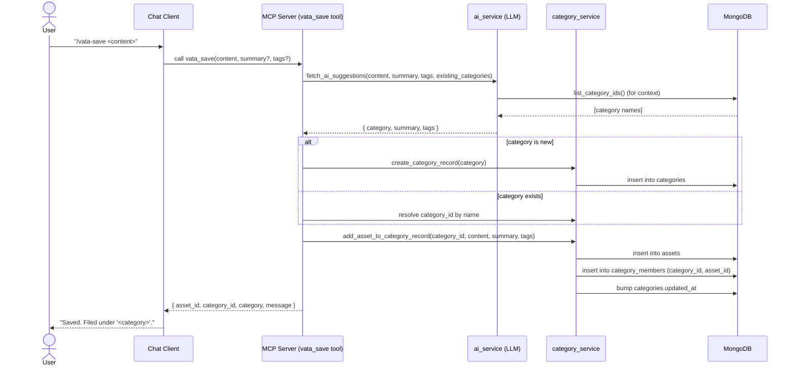
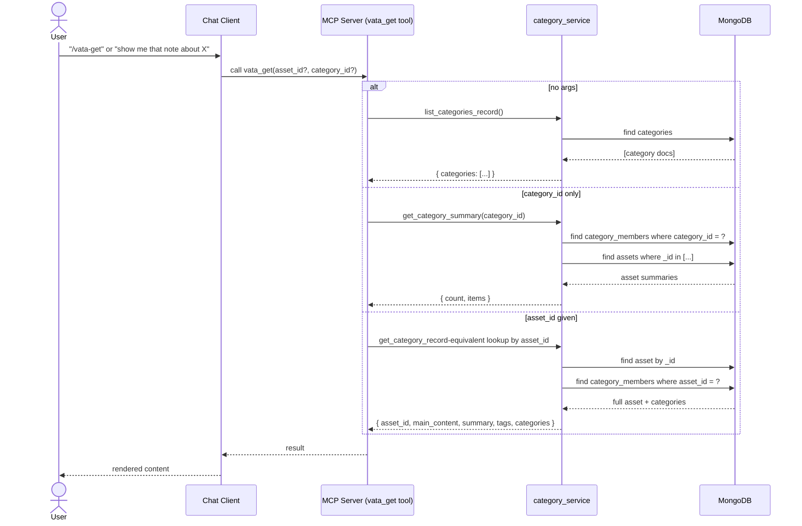
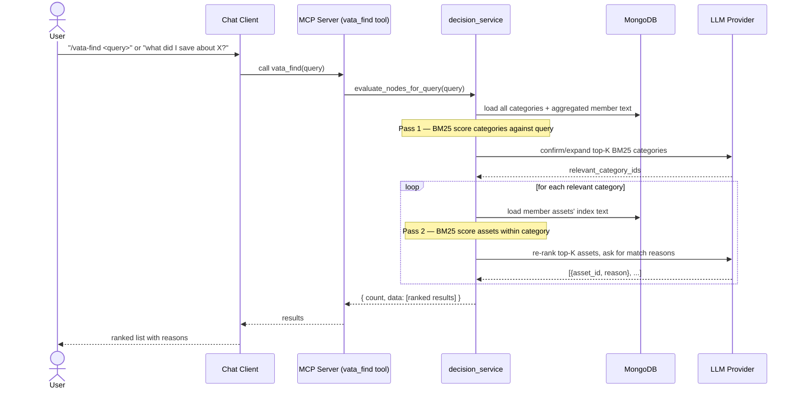
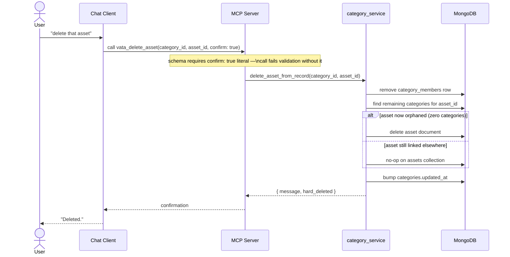
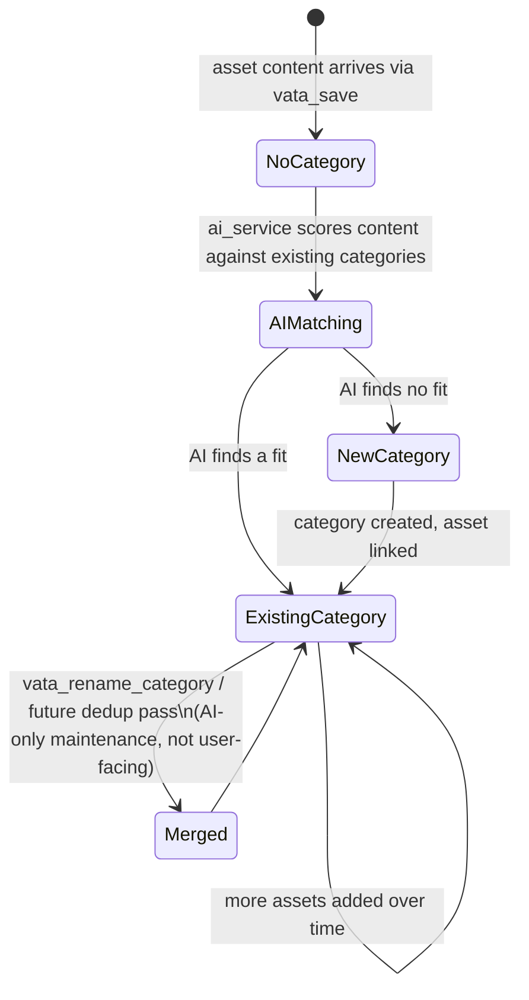
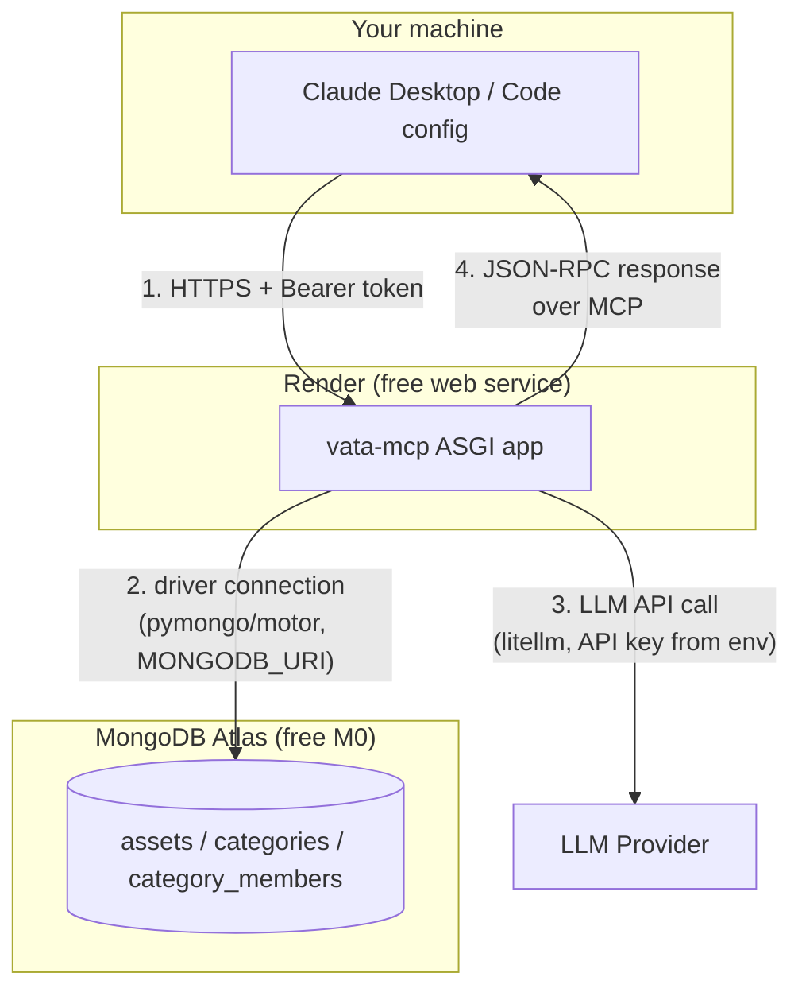

# Vata MCP — Data Flow Diagrams

Companion to [`VATA_MCP_PLAN.md`](VATA_MCP_PLAN.md) and
[`VATA_SCHEMA.md`](VATA_SCHEMA.md). Sequence diagrams for each major flow,
plus one system-level context diagram. Rendered as Mermaid — view in any
Mermaid-capable Markdown viewer (GitHub, VS Code with the Mermaid
extension, etc.).

---

## 1. System context

---

## 2. `vata_save` flow (AI decides the category — no user input on it)

---

## 3. `vata_get` flow (three shapes, one tool)

---

## 4. `vata_find` flow (BM25 pre-filter + LLM re-rank, two passes)

---

## 5. Destructive flow — `vata_delete_asset` (confirm-gated)

---

## 6. Category lifecycle (why this stays invisible to the user)

The user only ever sees asset-level results (`vata_find` results,
`vata_get` by `asset_id`). `category_id` values surface in tool
outputs for the *model's* bookkeeping (e.g. to call `vata_delete_asset`
correctly) — they aren't something the user should need to type or
remember.

---

## 7. Deployment/request path (hosting view)

