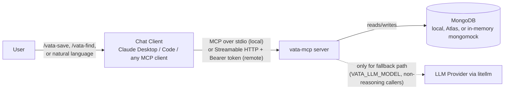
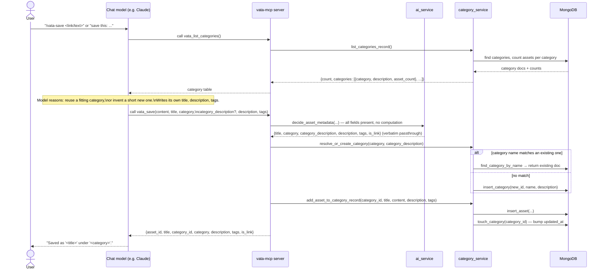
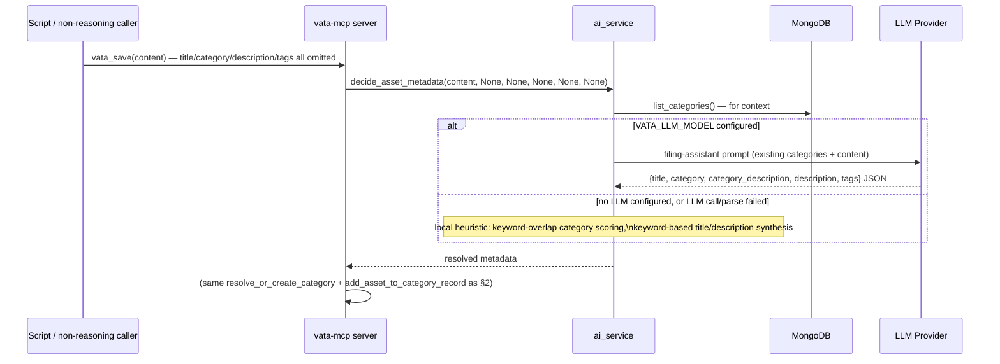
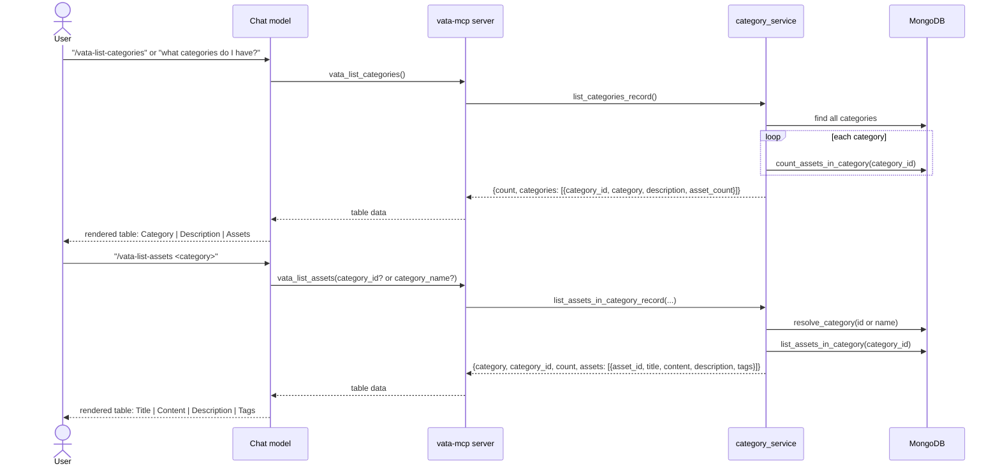
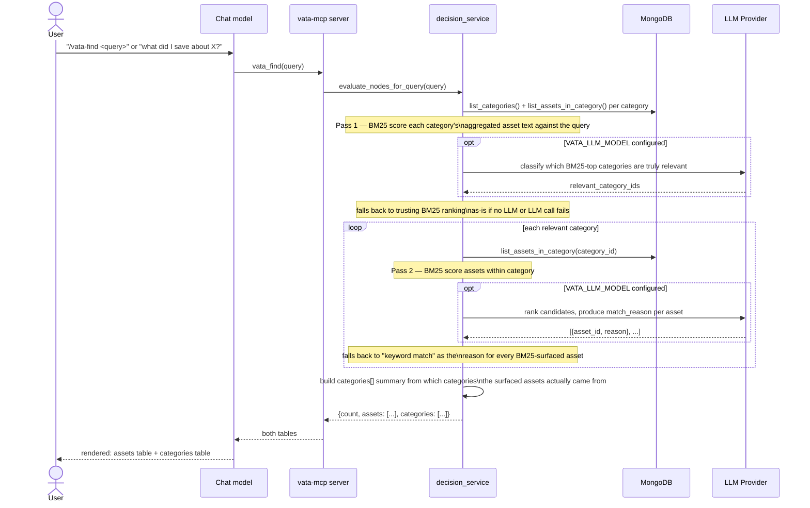
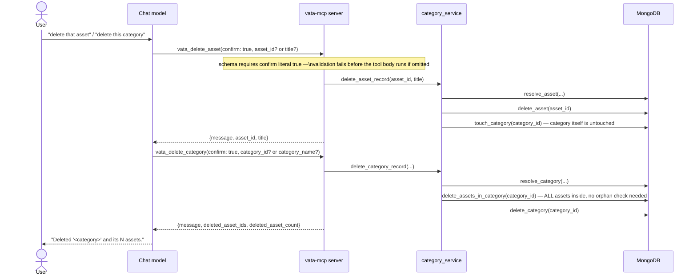
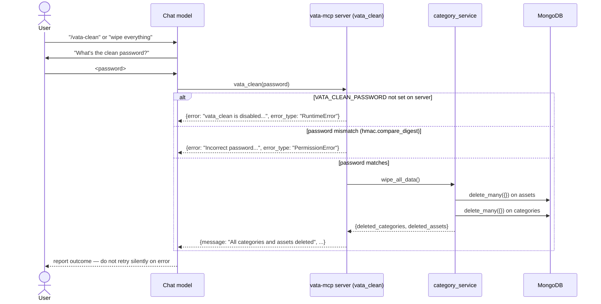
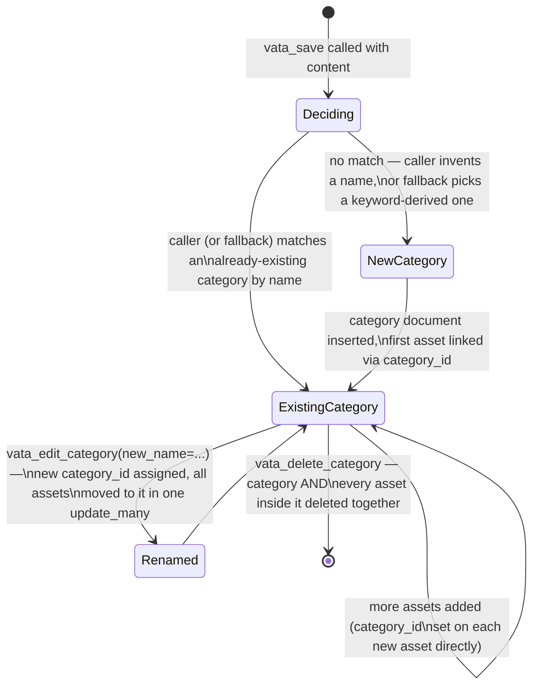
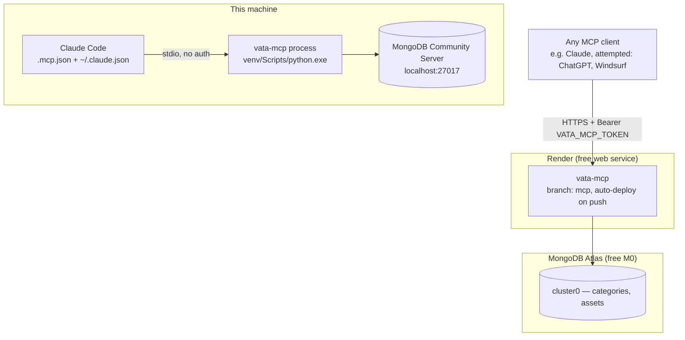

# Vata MCP — Data Flow Diagrams

Companion to [VATA_MCP_PLAN.md](VATA_MCP_PLAN.md) and
[VATA_SCHEMA.md](VATA_SCHEMA.md). Rendered as Mermaid. Reflects the
current implementation — the calling LLM decides categorization (plan
§2), one category per asset (plan §3).

---

## 1. System context

The chat client's own model (Claude, etc.) does the categorization
reasoning as part of normal tool use — it is not a separate box in this
diagram, it *is* the client. The dotted line to "LLM Provider" is a
second, independent LLM call the **server itself** can optionally make,
used only when a caller doesn't supply title/category/description/tags
(e.g. a bare script) and no reasoning model is in the loop.

---

## 2. `vata_save` — the calling LLM decides, the server just stores

### 2b. Fallback path — caller leaves fields blank (non-reasoning caller)

---

## 3. `vata_list_assets` / `vata_list_categories` — browsing

---

## 4. `vata_find` — BM25 two-pass search, assets AND categories returned

---

## 5. Destructive flows — confirm-gated, category delete cascades

No orphan-detection logic exists anymore (removed with the many-to-many
model) — deleting a category is an unconditional cascade, since an asset
can no longer belong to any other category that would keep it alive.

---

## 6. `vata_clean` — password-gated full wipe

---

## 7. Category lifecycle

Categories are addressable by name in tool calls, but the underlying
`category_id` is what actually links assets — the model doesn't need to
remember or expose raw ids to the user, but does need to pass them (or the
exact name) into edit/delete/list-assets calls.

---

## 8. Deployment topology (as currently live)

Two independent, unrelated databases exist right now: the local Mongo
instance (used by local Claude Code sessions) and the Atlas cluster (used
by the deployed Render service). They do not sync — saving locally does
not appear in the remote deployment and vice versa. This is expected
given the current single-database-per-process design, but worth
remembering if data seems "missing" when switching between local and
remote MCP configs.
